# Obsidian High Recall

语言：[English](README.md) | [中文](README.zh-CN.md)

[](https://github.com/ToussaintKnight/obsidian-high-recall-skill/actions/workflows/ci.yml)
[](LICENSE)
[](SECURITY.md)

面向 Obsidian vault 的 local-first 高召回检索，可从 Codex 和 CLI 使用。

Project page: https://toussaintknight.github.io/obsidian-high-recall-skill/

当你的 vault 有成千上万条笔记时，普通搜索和 agent memory 很容易漏掉关键笔记。这个项目刻意把 recall 放在 precision 前面：宁愿多返回一些上下文，也不要静默漏掉相关笔记。

它会优先复用 Smart Connections 的本地向量索引；没有 Smart 索引时，回退到 `obsidian-hybrid-search`；需要最大召回时，也可以合并两路结果。

## 适合谁

- 有大型本地 Obsidian vault 的研究者、工程师、founder 和分析师。
- 需要 Codex/CLI 在规划、写作、编码或总结前先拿到宽召回上下文的工作流。
- 原始笔记、snippet、query 和 label 都必须留在本地的隐私敏感工作。

它不是要替代 Obsidian 原生 UI 或 Smart Connections，而是一个 portable recall layer：优先复用已有本地索引，补上 fallback/union retrieval，并返回 agent-ready context pack。更多说明见：[docs/positioning.md](docs/positioning.md) 和 [docs/comparison.md](docs/comparison.md)。

常见隐私、backend、benchmark 和安装问题见：[docs/faq.md](docs/faq.md)。

## 30 秒 Demo

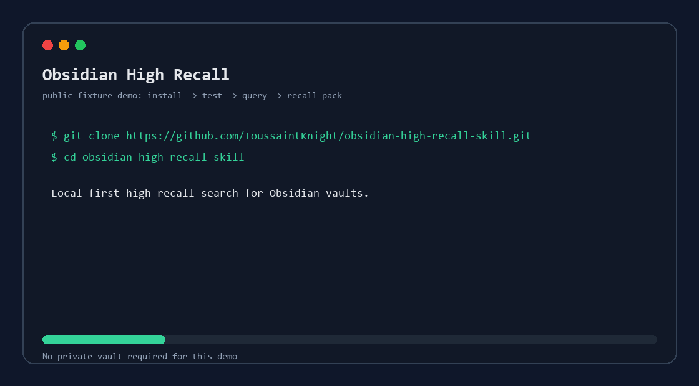

不需要私人 vault，先跑公开 fixture benchmark：

```bash
git clone https://github.com/ToussaintKnight/obsidian-high-recall-skill.git
cd obsidian-high-recall-skill
npm test
```

这个 fixture smoke test 只使用公开笔记，覆盖 5 个 recall cases：3 个英文、1 个中文、1 个中英混合。

Fixture 的预期输出和通过标准见：[docs/demo/fixture_walkthrough.md](docs/demo/fixture_walkthrough.md)。

Redacted public JSON examples 见：[docs/examples](docs/examples/README.md)。

直接查询 fixture vault：

```bash
node skills/obsidian-high-recall/scripts/obsidian_high_recall.mjs query "数据采集 for 具身" --vault docs/fixtures/demo-vault --backend smart --limit 10
```

用于你自己的 vault：

```bash
node skills/obsidian-high-recall/scripts/obsidian_high_recall.mjs query "机器人基础模型 演示数据" --vault "/absolute/path/to/your-vault" --backend auto --limit 120 --json
```

## 它能做什么

- 从 Obsidian app config 自动发现当前 vault。
- 读取 Smart Connections 已生成的 `.smart-env` 本地向量。
- 保留 lexical fallback，所以 fixture vault 和无向量缓存场景也可测试。
- 通过 `npx` 回退调用 `obsidian-hybrid-search`。
- 支持 `auto`、`smart`、`ohs`、`both` 四种 backend。
- 返回带 snippet、channel、score、rank 的高召回结果包，也支持 JSON 输出。
- JSON recall pack schema、结果字段、ranking 语义和分享安全标记见：[docs/output_contract.md](docs/output_contract.md)。
- 提供 privacy-safe `doctor --json` 诊断报告，用于 bug report 和 tester feedback。
- 派生索引和运行时依赖放在 vault 外部。
- Runtime downloads、本地 cache paths 和 dependency review 步骤见：[docs/dependency_inventory.md](docs/dependency_inventory.md)。

## 安装

完整 first-run 路径见 [docs/install.md](docs/install.md)，包括 public fixture validation、GitHub-backed `npx`、Codex skill 安装、backend setup 和 OS 注意事项。

### 从 GitHub 直接跑 CLI

```bash
npx --yes github:ToussaintKnight/obsidian-high-recall-skill query "数据采集 for 具身" --vault "/absolute/path/to/your-vault" --backend auto --limit 120
```

如果环境不支持 GitHub-backed `npx`，clone repo 后使用上面的本地 `node` 命令。

### Codex Skill

对 Codex 说：

```text
Use $skill-installer to install https://github.com/ToussaintKnight/obsidian-high-recall-skill/tree/main/skills/obsidian-high-recall
```

安装后重启 Codex。

### 手动安装 Skill

Windows PowerShell:

```powershell
git clone https://github.com/ToussaintKnight/obsidian-high-recall-skill.git
New-Item -ItemType Directory -Force "$env:USERPROFILE\.codex\skills" | Out-Null
Copy-Item ".\obsidian-high-recall-skill\skills\obsidian-high-recall" "$env:USERPROFILE\.codex\skills\" -Recurse
```

macOS/Linux:

```bash
git clone https://github.com/ToussaintKnight/obsidian-high-recall-skill.git
mkdir -p ~/.codex/skills
cp -R ./obsidian-high-recall-skill/skills/obsidian-high-recall ~/.codex/skills/
```

然后重启 Codex。

## 环境要求

- Node.js 20+。
- 本地磁盘上的 Obsidian vault。
- 推荐安装并完成索引：Obsidian Smart Connections 插件。
- OHS fallback 和首次模型/package 下载需要网络。

这个工具不会主动上传 vault 内容。隐私模型和安全反馈流程见：[SECURITY.md](SECURITY.md)。

## Backend 怎么选

- `auto`：有 Smart Connections `.smart-env` 时优先用 Smart，否则用 OHS。
- `smart`：使用 Smart Connections 本地 embedding，并加 lexical fallback。
- `ohs`：使用 `obsidian-hybrid-search` 的 hybrid/fulltext 检索。
- `both`：合并 Smart 和 OHS 结果；召回最好，但更慢。

推荐：

- 日常使用：`--backend auto --limit 120`
- 高风险/高召回任务：`--backend both --limit 200`
- 做评估：用 evaluator 比较 `smart`、`ohs` 和 `rrf-union`

## 在 Codex 里使用

直接问：

```text
Use $obsidian-high-recall to find a high-recall pack for "数据采集 for 具身".
```

如果需要最大召回：

```text
Use $obsidian-high-recall with backend both and limit 200 for "机器人基础模型 演示数据 遥操作 轨迹 采集".
```

## 命令行使用

进入已安装的 skill 目录：

```bash
node scripts/obsidian_high_recall.mjs detect
node scripts/obsidian_high_recall.mjs doctor --vault "/absolute/path/to/your-vault" --json
node scripts/obsidian_high_recall.mjs status
node scripts/obsidian_high_recall.mjs query "数据采集 for 具身" --backend auto --limit 120 --json
node scripts/obsidian_high_recall.mjs query "机器人 遥操作 演示数据" --backend both --limit 200 --per-channel 80 --json
```

如果自动发现 vault 失败：

```bash
node scripts/obsidian_high_recall.mjs query "my query" --vault "/absolute/path/to/your-vault" --json
```

完整命令和选项见：[docs/cli_reference.md](docs/cli_reference.md)。

JSON recall pack schema、结果字段、ranking 语义和分享安全标记见：[docs/output_contract.md](docs/output_contract.md)。

## 用法 Recipes

日常 recall、高风险召回 sweep、Codex preflight context、私有 benchmark、privacy-safe bug report 和 read-burden tuning 的 copy-paste 工作流见：[docs/recipes.md](docs/recipes.md)。

## 架构

这张图展示 local-first 检索流程、backend routing、privacy boundary，以及 public benchmark 发布路径。

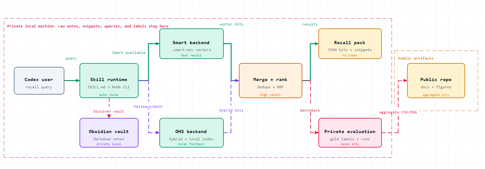

另一个 direct diagram 和可编辑 Archify source 在 [docs/architecture](docs/architecture/README.md)。

## Benchmark Snapshot

这是一个小规模 private-vault retrieval benchmark，用来测试这套部署方式的召回行为，不代表所有 Obsidian vault 的普遍结论。原始 note path、snippet 和 gold note 标识没有公开；repo 里只放 aggregate metrics 和匿名 case-level data。

早期 3-task pilot 结果归档在 [pilot_smoke_test.md](docs/benchmark/pilot_smoke_test.md)；下面的 16-task benchmark 是主结果。

**实验设置。** Vault snapshot 包含 255 个 Smart Connections files、6,220 个 Smart blocks、1,478 个 embedded blocks。Smart backend 使用 `TaylorAI/bge-micro-v2` embedding。OHS backend 使用 `obsidian-hybrid-search` `0.13.16`、`local:Xenova/multilingual-e5-small`，共 244 个 indexed files、1,450 个 chunks。每次运行固定 `limit=80`、`per-channel=30`、`neighbor-seeds=0`，评估 K=10/20/50。完整设置见：[settings.json](docs/benchmark/settings.json)。

**数据。** 评估集包含 16 个手工标注 recall tasks，共 95 个 gold labels。Query 语言分布为 6 个中文 query、6 个英文 query、4 个中英混合 query，覆盖 embodied data、robot demonstrations、world models、spatial/3D perception、tactile manipulation、humanoid robotics、JEPA/world-model notes、AI productivity tooling、robot companion use cases、Physical AI startups、simulation data engines、agent skills、biosignal dexterity。

**Ablations。** 实验比较 3 个条件：Smart Connections recall (`smart`)、OHS hybrid/fulltext recall (`ohs`)、以及对 Smart 和 OHS 排名结果做 reciprocal-rank-fusion 的可部署 union (`rrf-union`)。完整 aggregate data 见：[summary_metrics.csv](docs/benchmark/summary_metrics.csv)。匿名 case-level metrics 见：[case_metrics_at20.csv](docs/benchmark/case_metrics_at20.csv)。

**K=20 主要结果。**

| condition | Precision@20 | Recall@20 | F1@20 | MRR | mean latency |
|---|---:|---:|---:|---:|---:|
| Smart | 0.17 | 0.57 | 0.26 | 0.65 | 1.00s |
| OHS | 0.17 | 0.55 | 0.25 | 0.24 | 49.54s |
| RRF union | 0.18 | 0.61 | 0.28 | 0.61 | 50.54s |

在 K=20 时，RRF union 的 mean Recall 和 F1 最高；Smart 大约快 50 倍，并且保留最强的 first-hit behavior。在 K=50 时，本轮扩样实验 Smart 的 mean recall 最高：Smart `0.87`、OHS `0.73`、RRF union `0.82`。实际 tradeoff 很清楚：日常 recall 用 Smart/`auto`；只有在能接受额外延迟时，再用 union/OHS。

**参数敏感性。** 上面的固定 operating point 不代表最优参数。我们额外做了 Smart-only sensitivity grid：扫 `per-channel ∈ {10,30,60,100}` 和 `neighbor-seeds ∈ {0,10,25,50}`，固定 `limit=120`，并评估 K=10/20/50/80/120。完整 grid data 见：[sensitivity_smart_grid.csv](docs/benchmark/sensitivity_smart_grid.csv)。主图使用 collapse over `neighbor-seeds` 后的 K × per-channel 表：[sensitivity_smart_collapsed.csv](docs/benchmark/sensitivity_smart_collapsed.csv)；实验设置和 no-op diagnostic 见：[sensitivity_settings.json](docs/benchmark/sensitivity_settings.json)。

`neighbor-seeds` 在这轮 Smart-only 实验里产生了完全相同的 ranking：跨 `neighbor-seeds` 的 Precision、Recall、F1、MRR、retrieved count、result count 最大变化都是 `0.0`。这符合当前 wrapper 路径：`neighbor-seeds` 只会在 merged results 暴露 links/backlinks 时加入 graph neighbors；而这个 snapshot 的 Smart-only channel results 没有改变 graph-neighbor candidate set。因此主图把 `neighbor-seeds` collapse 掉，把它作为 diagnostic control，而不是有意义的优化轴。

在 K=50 时，默认 `per-channel=30` 的 mean Recall 最高（`0.87`），但 `per-channel=10` 非常接近（`0.85`），同时 F1 更高（`0.25` vs `0.20`）、Precision 更高（`0.145` vs `0.112`）、阅读负担更低（36 vs 48 个返回结果）。更宽的 candidate pool 并不单调更好：`per-channel=60/100` 把 Recall@50 降到 `0.79/0.81`，同时返回 85/116 个结果。把 K 提高到 120 可以让 `per-channel=60/100` 的 Recall 恢复到 `0.96`，但 Precision 会降到 `0.068/0.050`。

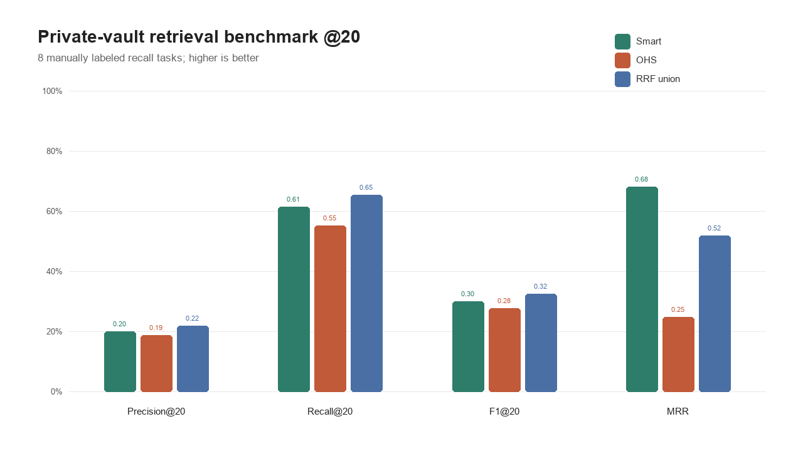

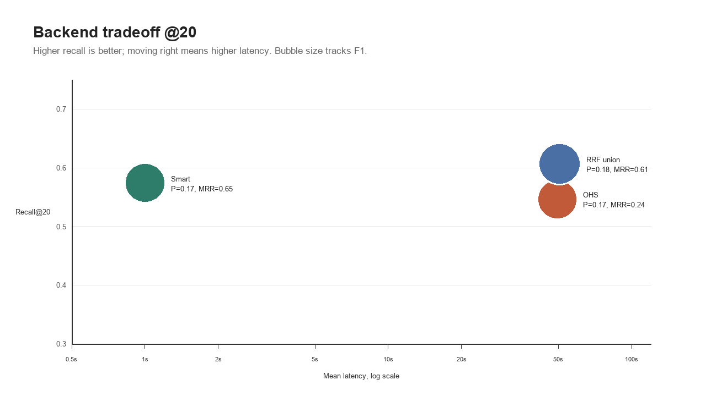

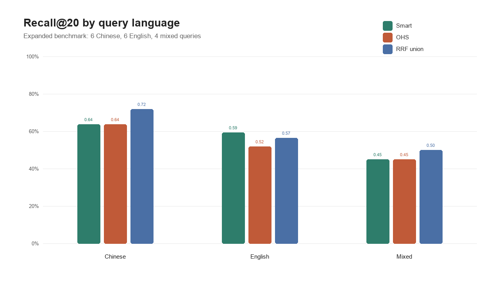

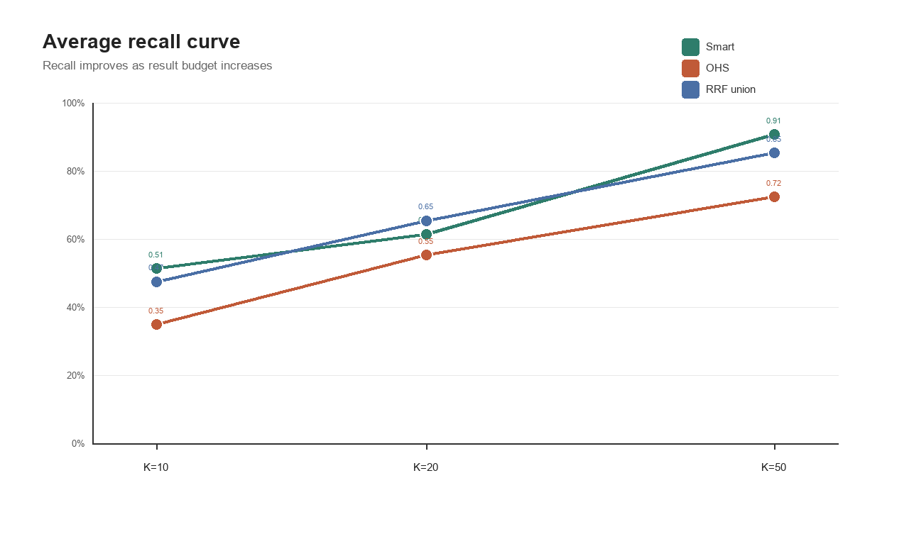

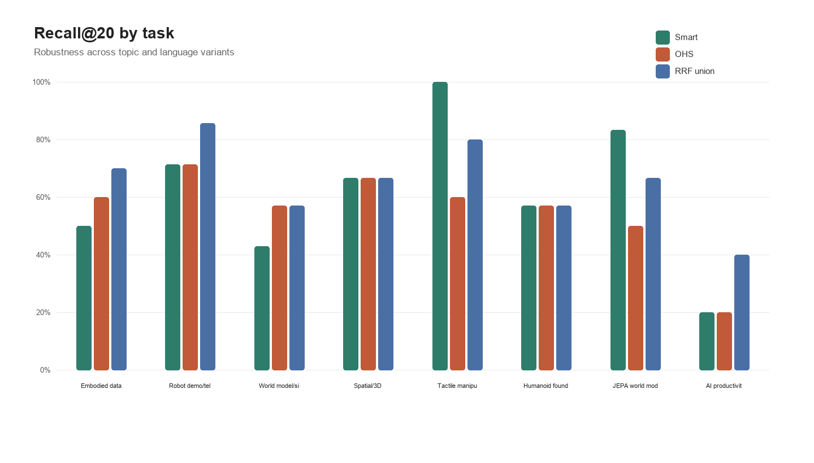

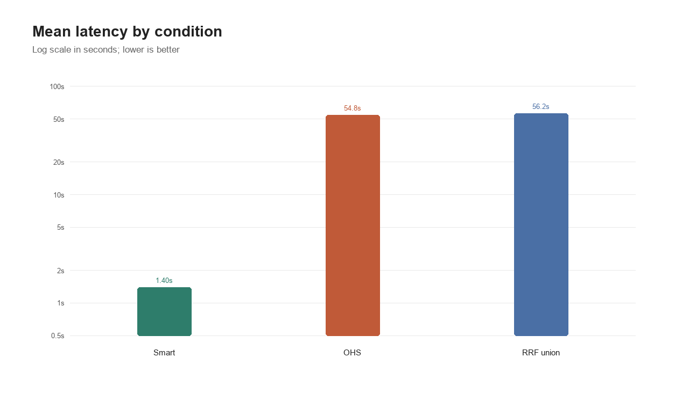

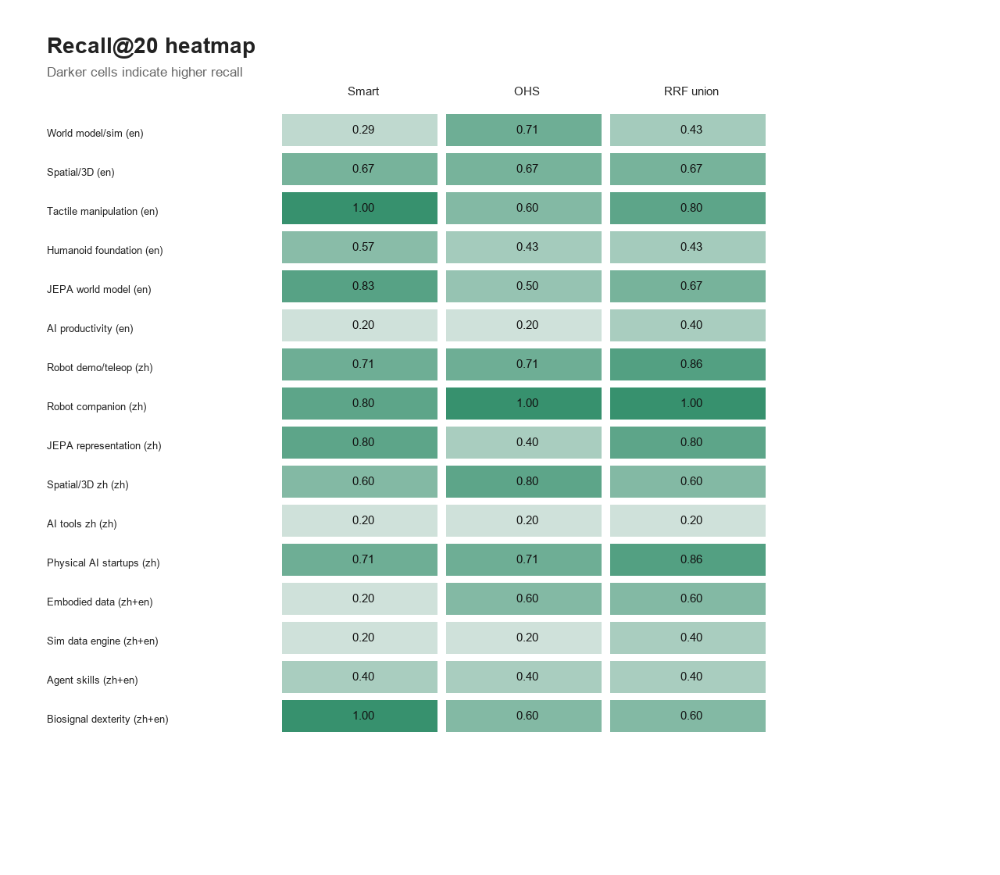

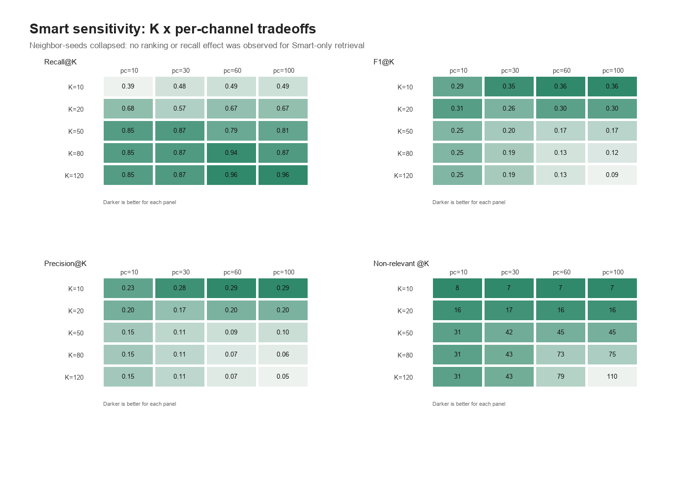

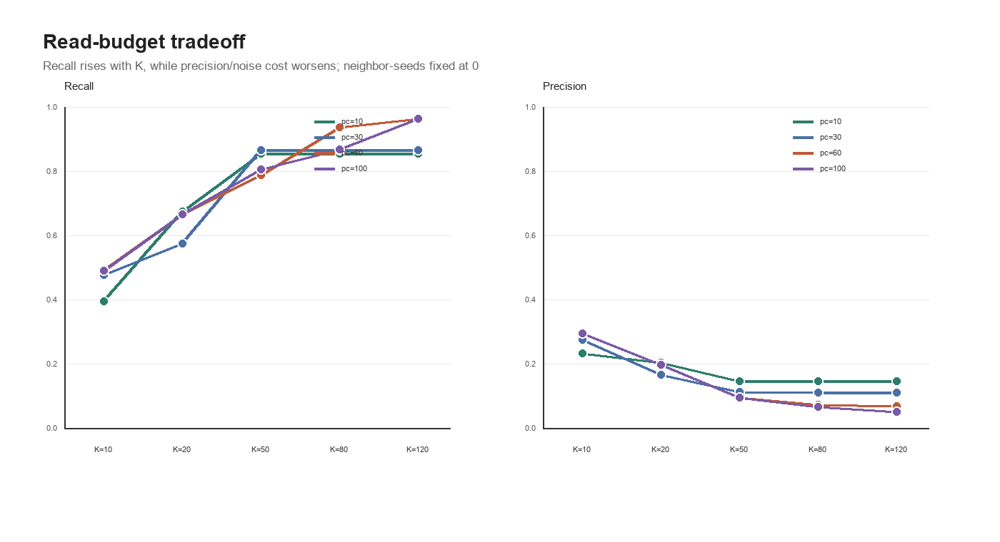

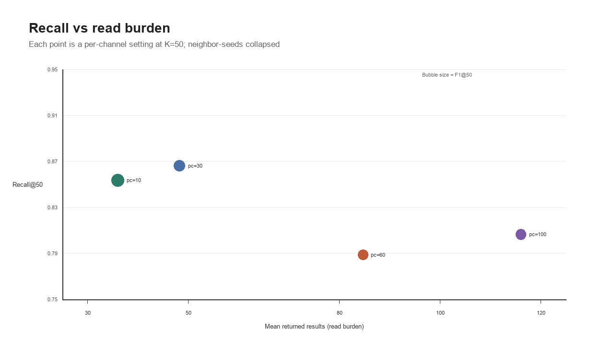

**局限性。** Gold set 仍然较小，而且是人工 seed 的，所以 Precision@K 偏保守：没有被标为 gold 但实际有用的 notes 会被算成 false positives。Vault 是 private 且 domain-skewed，所以这些结果更适合作为当前部署模式的 robustness smoke test，不是所有 Obsidian vault 的通用 benchmark。

## 召回评估

先跑公开 fixture smoke test：

```bash
npm run smoke:fixture
```

CI 也会运行一个 deterministic RRF union smoke test，不需要触发 OHS 下载：

```bash
npm run rrf:check
```

然后为你自己的 vault 创建 cases 文件：

```json
[
  {
    "id": "my-topic",
    "query": "这个 topic 的宽泛自然语言 query",
    "gold": [
      "已知相关笔记标题",
      "folder/or/path-substring"
    ]
  }
]
```

运行：

```bash
node skills/obsidian-high-recall/scripts/evaluate_recall.mjs ./obsidian_recall_eval --vault "/absolute/path/to/your-vault" --cases ./cases.json --backends smart,ohs,rrf-union --ks 10,20,50
```

输出：

- `raw_runs.json`
- `metrics.json`
- `metrics.csv`

指标包括 Precision@K、Recall@K、F1@K、MRR、gold note rank、返回数量，以及 `smart`、`ohs`、evaluator-derived `rrf-union` 的延迟。

## 分享匿名 Benchmark 报告

真实 vault 的报告很有价值，但必须保持隐私安全。如果你在自己的 vault 上试用，请通过 [benchmark report issue template](https://github.com/ToussaintKnight/obsidian-high-recall-skill/issues/new?template=benchmark_report.yml) 分享 aggregate metrics。不要公开 raw runs、private cases 文件、note path、snippet、raw query、vault name 或 gold label。

安全报告格式见：[docs/benchmark/reporting_guide.md](docs/benchmark/reporting_guide.md)。

## 帮忙测试

早期最有价值的贡献，是从真实操作系统和 vault 设置里给出 privacy-safe install/recall report。先看 [docs/testing_guide.md](docs/testing_guide.md)，然后通过 [tester feedback template](https://github.com/ToussaintKnight/obsidian-high-recall-skill/issues/new?template=tester_feedback.yml) 分享结果。

公开 OS/backend 覆盖情况记录在 [docs/compatibility.md](docs/compatibility.md)。

## Repo 结构

```text
.github/
  ISSUE_TEMPLATE/
docs/
  architecture/
  benchmark/
  fixtures/
skills/
  obsidian-high-recall/
    SKILL.md
    agents/openai.yaml
    references/
    scripts/
```

## 社区和项目健康度

- 安全和隐私模型：[SECURITY.md](SECURITY.md)
- 安装指南：[docs/install.md](docs/install.md)
- NPM publish readiness：[docs/npm_publish.md](docs/npm_publish.md)，`npm run publish:check`
- CI matrix：Linux、Windows、macOS 都运行 `npm test`
- 隐私泄漏检查：`npm run privacy:scan`
- Privacy threat model：[docs/privacy_threat_model.md](docs/privacy_threat_model.md)，`npm run privacy:docs`
- Dependency and network inventory：[docs/dependency_inventory.md](docs/dependency_inventory.md)，`npm run dependency:check`
- 文档链接检查：`npm run docs:links`
- FAQ 检查：`npm run faq:check`
- 安装指南检查：`npm run install:check`
- Public examples 检查：`npm run examples:check`
- 用法 recipes 检查：`npm run recipes:check`
- Demo walkthrough 检查：`npm run demo:check`
- CLI reference 检查：`npm run cli:check`
- Output contract 检查：`npm run output:check`
- Codex skill 结构检查：`npm run skill:check`
- Positioning 和 comparison 检查：`npm run positioning:check`
- Changelog 和 release notes：[CHANGELOG.md](CHANGELOG.md)，`npm run release:check`
- 支持入口：[SUPPORT.md](SUPPORT.md)
- 贡献指南：[CONTRIBUTING.md](CONTRIBUTING.md)
- Issue templates 和 tester feedback：[new issue chooser](https://github.com/ToussaintKnight/obsidian-high-recall-skill/issues/new/choose)
- Starter issue playbook：[docs/community/starter_issues.md](docs/community/starter_issues.md)
- Repository setup checklist：[docs/community/repository_setup.md](docs/community/repository_setup.md)
- Maintenance playbook：[docs/community/maintenance.md](docs/community/maintenance.md)
- FAQ：[docs/faq.md](docs/faq.md)
- CLI reference：[docs/cli_reference.md](docs/cli_reference.md)
- Public output examples：[docs/examples](docs/examples/README.md)
- 用法 recipes：[docs/recipes.md](docs/recipes.md)
- Output contract：[docs/output_contract.md](docs/output_contract.md)
- Troubleshooting：[docs/troubleshooting.md](docs/troubleshooting.md)
- Testing guide：[docs/testing_guide.md](docs/testing_guide.md)
- Compatibility matrix：[docs/compatibility.md](docs/compatibility.md)
- Roadmap：[ROADMAP.md](ROADMAP.md)
- Launch playbook：[docs/LAUNCH.md](docs/LAUNCH.md)
- Marketing kit：[docs/marketing](docs/marketing/README.md)
- Launch experiment plan：[docs/marketing/launch_experiment.md](docs/marketing/launch_experiment.md)，`npm run launch:check`
- Share page：[docs/index.html](docs/index.html)
- Positioning and fit：[docs/positioning.md](docs/positioning.md)
- Comparison and decision guide：[docs/comparison.md](docs/comparison.md)
- 匿名 benchmark 报告指南：[docs/benchmark/reporting_guide.md](docs/benchmark/reporting_guide.md)
- Launch baseline：[docs/metrics/launch_baseline.md](docs/metrics/launch_baseline.md)
- External contribution strategy：[docs/community/external_contribution_strategy.md](docs/community/external_contribution_strategy.md)
- GitHub labels manifest：[.github/labels.yml](.github/labels.yml)
- Community file gate：`npm run community:check`
- Public fixture vault：[docs/fixtures/demo-vault](docs/fixtures/demo-vault)
- Citation metadata：[CITATION.cff](CITATION.cff)

## License

MIT
