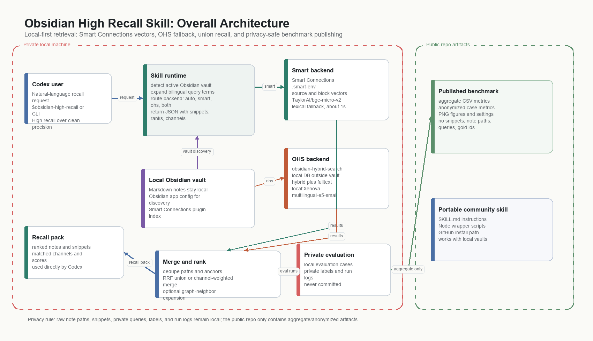

# Architecture Diagram Candidates

This directory contains two candidate overall architecture diagrams for the README. Both show the same system:

- Codex sends a natural-language recall request to the skill runtime.
- The skill auto-detects the local Obsidian vault and routes retrieval through Smart Connections, OHS, or both.
- Smart Connections provides the fast vector path; OHS provides a slower hybrid/fulltext fallback.
- Results are deduped and merged into a recall pack for Codex.
- Private notes, snippets, queries, labels, and evaluation artifacts stay local.
- The public repo contains only the portable skill, docs, anonymized aggregate metrics, and figures.

## Option A: Direct Static Diagram

Use this option if the README should be explanatory and self-contained at a glance.

## Option B: Archify-Generated Diagram

This option was generated with Archify from [architecture_option_b_archify.architecture.json](architecture_option_b_archify.architecture.json). The interactive export is [architecture_option_b_archify.html](architecture_option_b_archify.html), and the static SVG export is [architecture_option_b_archify.svg](architecture_option_b_archify.svg).

Use this option if the README should emphasize a cleaner diagramming style and reusable source.
