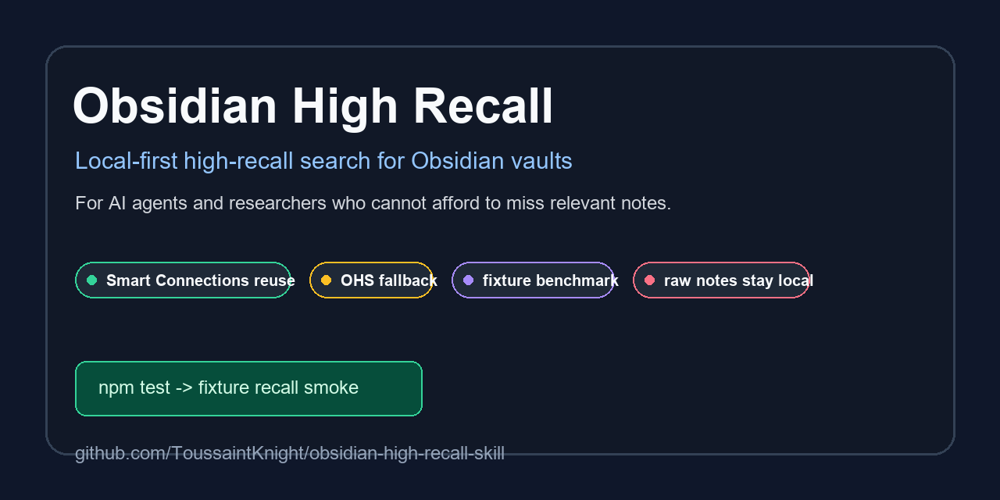

# Marketing And Outreach Kit

This page is copy-ready launch material. Keep the public hook broad: Obsidian, local-first search, AI agents, and researchers. Do not lead with "Codex skill" outside Codex communities.

Social preview card:



Share page:

https://toussaintknight.github.io/obsidian-high-recall-skill/

Community launch posts:

[community_launch_posts.md](community_launch_posts.md)

Repository setup checklist:

[../community/repository_setup.md](../community/repository_setup.md)

Comparison and fit guide:

[../comparison.md](../comparison.md)

Regenerate:

```bash
npm run social:card
npm run site:check
```

## One-Liner

Local-first high-recall search for Obsidian vaults, designed for AI agents and researchers who cannot afford to miss relevant notes.

## Short Description

Obsidian High Recall helps agents and humans search large private Obsidian vaults with recall-first retrieval. It reuses Smart Connections vectors when available, falls back locally when not, and includes a public fixture benchmark so people can test it without sharing private notes.

## Proof Points

- Public fixture vault: `npm test` runs without a private vault.
- Privacy model: raw notes, snippets, private queries, and local labels stay local.
- Backends: Smart Connections, OHS fallback, and evaluator-derived RRF union.
- Benchmark: private-vault aggregate results are published with anonymized metrics and limitations.
- Community: v0.1.0 release, issue templates, tester feedback form, tester discussion, starter issue playbook, and benchmark-report template are live.

## Primary Call To Action

Try the fixture demo, then report whether it works on your OS and vault setup:

```bash
git clone https://github.com/ToussaintKnight/obsidian-high-recall-skill.git
cd obsidian-high-recall-skill
npm test
```

Tester discussion: https://github.com/ToussaintKnight/obsidian-high-recall-skill/discussions/9
Testing guide: https://github.com/ToussaintKnight/obsidian-high-recall-skill/blob/main/docs/testing_guide.md

## Obsidian Forum Post

Title:

```text
Local-first high-recall search for Obsidian vaults, usable from Codex and CLI
```

Body:

~~~markdown
I built a small local-first tool for a problem I keep hitting: when an Obsidian vault gets large, AI agents and normal search can miss relevant notes.

Obsidian High Recall favors recall over precision. It reuses Smart Connections vectors when available, falls back locally when not, and can also use obsidian-hybrid-search for hybrid/fulltext retrieval. Raw notes, snippets, queries, and private benchmark labels stay local.

Repo: https://github.com/ToussaintKnight/obsidian-high-recall-skill
Project page: https://toussaintknight.github.io/obsidian-high-recall-skill/
Release: https://github.com/ToussaintKnight/obsidian-high-recall-skill/releases/tag/v0.1.0
Testing guide: https://github.com/ToussaintKnight/obsidian-high-recall-skill/blob/main/docs/testing_guide.md
Demo GIF: https://github.com/ToussaintKnight/obsidian-high-recall-skill/blob/main/docs/demo/fixture_demo.gif

Try the public fixture first:

```bash
git clone https://github.com/ToussaintKnight/obsidian-high-recall-skill.git
cd obsidian-high-recall-skill
npm test
```

Then run it on your vault:

```bash
node skills/obsidian-high-recall/scripts/obsidian_high_recall.mjs query "your broad research query" --vault "/absolute/path/to/your-vault" --backend auto --limit 120
```

I am looking for 5-10 testers with different vault sizes and operating systems. Aggregate benchmark reports are welcome, but please do not share private note paths, snippets, raw queries, or vault names.
~~~

## Hacker News / Reddit Titles

- Show HN: Local-first high-recall search for Obsidian vaults
- I built a local-first recall tool for large Obsidian vaults
- Obsidian High Recall: find notes your AI agent would otherwise miss

## Short Social Posts

```text
I released Obsidian High Recall v0.1.0: local-first high-recall search for Obsidian vaults, usable from Codex and CLI.

It favors recall over precision, reuses Smart Connections vectors when available, includes a public fixture benchmark, and keeps raw notes local.

Looking for testers:
https://toussaintknight.github.io/obsidian-high-recall-skill/
```

```text
If you use Obsidian as research memory: normal search and AI agents can miss relevant notes.

Obsidian High Recall is a local-first, recall-first search wrapper with Smart Connections reuse, OHS fallback, and privacy-safe benchmark docs.

v0.1.0:
https://toussaintknight.github.io/obsidian-high-recall-skill/
```

## Follow-Up Metrics

- GitHub views and unique visitors.
- Fixture benchmark runs reported.
- OS compatibility reports.
- Anonymized benchmark reports.
- Issues opened by real users.
- Stars after each launch channel.
